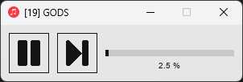

# LightMusicPlayer

This project is a very simple music player, made exclusively for my own personal usage.

It loads all files from a specified folder, and then play them in a random order.

## Usage

To be used, it needs either :
- a `default_path.py` file containing a variable named `DEFAULT_PATH` containing the path to the music folder
- a `path.txt` file containing the path to the music folder

It's then possible to create "playlists" by adding a (optional) `playlist.txt` file containing a folder name, which will be concatenated to the music folder path. The app will then load all files from this folder. If this file is not defined, it will look in the music folder directly.

Only MP3, OGG and WAV files will be loaded.

The [pygame](https://www.pygame.org/) Python module must be installed to run it.

## Assets

- Buttons icon by [kenney.nl](https://kenney.nl/)
- [App icon](https://www.iconarchive.com/show/yosemite-flat-icons-by-dtafalonso/Music-icon.html) [CC BY-ND 4.0]
